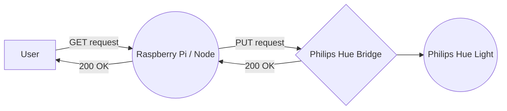

# Philips Hue API w/ Raspberry & NodeJS

> now you can get my attention by making my whole room blink.

- [Links](#links)
- [Disclaimer](#disclaimer)
- [Stack](#stack)
- [What you need](#what-you-need)
- [Step 1: Install Node on Raspberry Pi](#step-1:-install-node-on-raspberry-pi)
- [Step 2: Obtain Philips username](#step-2:-obtain-philips-username)
- [Step 3: Create the server](#step-3:-create-the-server)
- [Step 4: Port forward your Raspberry Pi](#step-4:-port-forward-your-raspberry-pi)
- [Step 5: Transfer server to Raspberry Pi](#step-5:-transfer-server-to-raspberry-pi)
- [Step 6: Run the server](#step-6:-run-the-server)
- [Step 7: Create the client and deploy](#step-7:-create-the-client-and-deploy)

# Links

App [Github pages](https://ojself.github.io/hueBlinkClient/)
Client [repository](https://github.com/Ojself/hueBlinkClient)
Server [repository](https://github.com/Ojself/hueBlinkClient)

# Disclaimer

This application was created for my significant other and was never meant to work as a guide. However, as I figured it was more difficult than first imagined, I decided to note down my steps and publish it here. I've never written a guide before and mistakes have been made. Feel free to contribute or give me feedback on my work.

A little note about security. I know it and I love it, but I haven't always followed the rules in this repository. I sprinkle IP-addresses left and right and whoever is using this repo should be cautious.
I hope the sticklers will forgive me.

# Stack

- NodeJS
- Express
- Axios
- HTML & CSS
- (MongoDB)

# What you need

- Raspberry Pi w/ memory card 16GB
- Philips Hue Lights (w/color)
- Philips Hue Bridge
- ~~A girlfriend~~

## Step 1: Install NodeJS on Raspberry Pi

I suggest following
[W3Schools](https://www.w3schools.com/nodejs/nodejs_raspberrypi.asp) tutorial on how to install NodeJS on your Raspberry Pi. Please note down your Raspberry Pi **username**, **password** and **IP** for later usage

## Step 2: Obtain Philips username

Go to your Philips Hue ip adress + /debug/clip.html
Mine is [http://192.168.178.74/debug/clip.html](http://192.168.178.74/debug/clip.html), but yours could be different. If you don't have your address, you could go into your router and look for Philips Hue (default name) and get the IP from there.

When inside the CLIP, type in '/api' in the URL-form and
`{"devicetype": "USERNAME"}` in the Message Body -
change out the USERNAME with a username of your choosing.
If you don't receive a username when you click **POST**, try clicking the physical Hue Bridge button and click **POST** again, you have 30 seconds to do so. Note down the received username.


If you wanna play around in the CLIP you can try
**GET:** `/api/<USERNAME40CHARLONG>/lights`
to get status of your lights and:

**PUT:** `/api/<USERNAME40CHARLONG>/lights/1/state`
message body: `{"on": true}` to turn ON the first light.
OR `{"on": false}` for turning it OFF

## Step 3: Create a server

[This](https://github.com/Ojself/hueBlinkServer) repository has the basic stuff already set up with additional authentication and MongoDB available.

#### Step 3.1: Cloning the server

(replace `<my-project>` and `<https://github.com/user/my-project.git>` by what you want, without `<` and `>`).

```sh
# Clone the project with only the last commit and save it in the folder <my-project>
$ git clone --depth=1 https://github.com/Ojself/hueBlinkServer <my-project>

$ cd <my-project>
$ rm -rf .git
$ git init

# Set your GitHub repository as the "origin" remote repository
$ git remote add origin <https://github.com/user/my-project.git>
```

#### Step 3.2: Files to add

You should have a `server/.env` file, with for example the following values:

```
PORT=2525
ENV=development
username=<USERNAME40CHARLONG>
host=<IP_ADRESS_TO_PHILIPS_HUE>
mongodb_uri=mongodb://localhost/hueattention
```

> remember to replace username with username and host with IP

#### Step 3.3

**To install all the packages**

```sh
# Install server packages
$ npm install
```

**To run the server**

```sh
# Open a first terminal
$ npm start
# Run the server on http://localhost:2525/

```

**To make changes to the functions**
All the good stuff can be changed inside the routes
`server/routes/index.js`
Check out this [repository](https://github.com/peter-murray/node-hue-api) to see what functions are available for your Philips Hue lights.

## Step 4: Port forward your Raspberry Pi

Port forwarding can be a bit tricky because every router is different and it's challenging to find a tutorial that fits to your exact router at home.
This port forward [tutorial](https://www.youtube.com/watch?v=lSugZwBJ25g) was helpful for me, and might be for you. The tutorial shows how to set up SSH, but you also need HTTP and/or HTTPS as well.

> Remember, when setting up the server, make sure that the port matches with the port you set in the `server/.env` - default is 2525

If everything went correctly, you can open the terminal and try:
`$ ssh -p<PORT> <USERNAME>@<EXTERNALIP>`
eg:
`$ ssh -p22 pi@<88.91.15.22>`
After typing in your password when prompted, you should be connected to your Raspberry Pi through the internet.

## Step 5: Transfer server to Raspberry Pi

[FileZilla](https://filezilla-project.org/) is a free ftp-solution which is great to transfer file to your Raspberry Pi. Enter the credentials for **Host** (your Philips Hue IP), **Username**(default: pi), **password** (default is empty) and **Port** (default: 22) and click 'connect'.

> Make sure that the Raspberry Pi is connected to your wifi.

When connected, upload your server by right-clicking the server folder and click 'upload'. Now, the whole folder is being transferred, including node-modules..
When completed, you can delete the node-modules from the Raspberry Pi - we'll reinstall them later.

## Step 6: Run the server

Connect to your Raspberry Pi the same way you did in Step 1, through Terminal or Putty:
`$ ssh -p<PORT> <USERNAME>@<EXTERNALIP>`
eg:
`$ ssh -p22 pi@<88.91.15.22>`

#### Step 6.1:

navigate yourself to the server folder and go inside it.
`$ cd <SERVER NAME>`

#### Step 6.2:

and install the NPMs
`$ npm install`

#### Step 6.3:

and rund the server
`npm start`

## Step 7: Create the client and deploy

Clone [this](https://github.com/Ojself/hueBlinkClient) repository and change the IP-address provided in the index.js with your own, external ip. Deploy it to github pages through settings on github.

#### Step by step on how to clone repository:

(replace `<my-project>` and `<https://github.com/user/my-project.git>` by what you want, without `<` and `>`).

```sh
# Clone the project with only the last commit and save it in the folder <my-project>
$ git clone --depth=1 https://github.com/Ojself/hueBlinkClient <my-project>

$ cd <my-project>
$ rm -rf .git
$ git init

# Set your GitHub repository as the "origin" remote repository
$ git remote add origin <https://github.com/user/my-project.git>
```

And here's a flow chart of the process because why not


